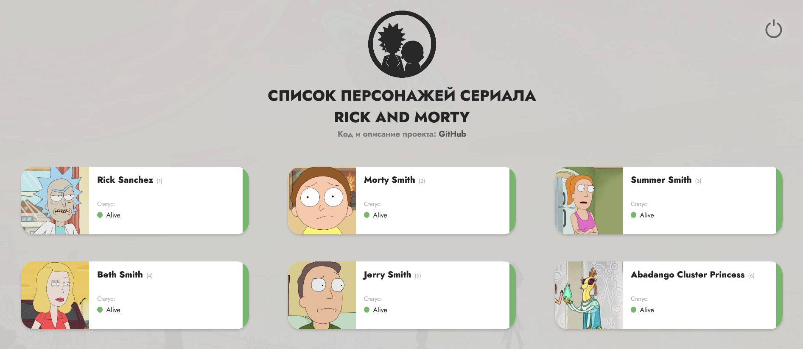

# Список персонажней Рик и Морти
https://rick-morty-for-nethouse.netlify.app/

Приложение демонстрирует работу с REST API на React и имеет дополнительный функционал:

- Бесконечный скроллинг - подгрузка новых персонажей при достижении конца страницы, 
- 3D карточка с информацией о выбранном персонаже,
- Анимация загрузки во время получения информации,
- Тёмный режим, реализованный через подгрузку дополнительных css стилей

С помощью Axious обращается к внешнему api для получения данных о персонажах:
https://rickandmortyapi.com/

Разработано со следующим стеком:
Create-React-App / React-Router / Axios / React Hooks / SCSS / React-Spring

